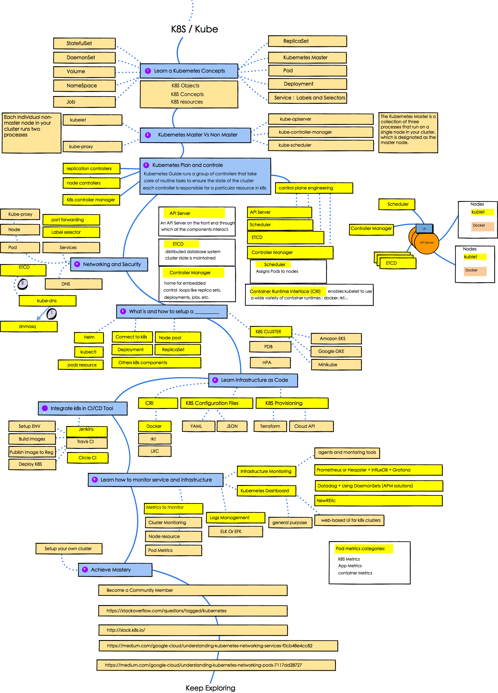

# k8s-landscape
The purpose of this repos is to give you an idea about k8s and k8s aspects

## K8S LEARNING MAP:

## ☑ TODO

- [ ] Networking in K8S
- [ ] Setup deployments in K8S using jinja templates
- [ ] Build K8S Cluster using Terraform
- [ ] Setup Montoring for K8S
